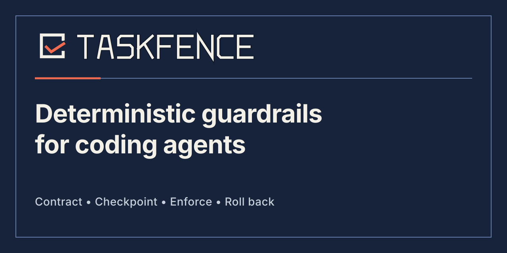
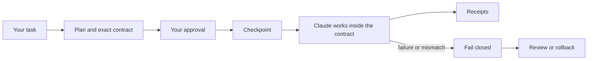

<p align="center">
  
</p>

<p align="center">
  <a href="https://github.com/iannellomarco/taskfence/actions/workflows/ci.yml"></a>
  <a href="LICENSE"></a>
  <a href="package.json"></a>
</p>

## Let Claude Code work inside a fence

Claude Code already shows you a plan. TaskFence turns that plan into a contract it must follow.

You approve the files Claude may change and the commands it may run for one task. TaskFence saves a restore point before work begins, checks supported write and command tool calls against the approved plan, records what happened, and can put the project back if something goes wrong.

You do not need to write the contract yourself. The included setup skill prepares it from the task you describe.

<p align="center">
  
</p>

## A simple example

Suppose you ask Claude:

> Change the phone number in my website footer. Do not change anything else.

TaskFence turns that request into a narrow set of permissions for this one task. Before work begins, you see and approve something like:

- Claude may edit the footer file.
- Claude may run the existing website test.
- Claude may not change any other file or run any other command.

TaskFence then saves a restore point. The expected footer edit is allowed, but an attempt to also update a dependency, delete an image, or change a different page is blocked. When you are happy with the result, you close the task. If something went wrong, you can preview and restore the project to its pre-task state.

You do not need to know the file names in advance or write a contract. The setup skill inspects the project, prepares the exact scope, and shows it to you for approval. TaskFence does not decide whether Claude's work is good; it keeps supported Claude Code tool calls inside the boundaries you approved and gives you a way back.

## Install in Claude Code

### What you need

- Claude Code with plugin support
- Node.js 20 or newer (`node --version` shows your installed version)
- macOS or Linux
- Claude Code's default plan directory; custom `plansDirectory` settings are not supported in TaskFence 0.1.3

### 1. Add and install the plugin

Run these commands inside Claude Code:

```text
/plugin marketplace add iannellomarco/taskfence
/plugin install taskfence@taskfence
/reload-plugins
```

When Claude Code asks for an installation scope, choose **Local** for your first try. That enables TaskFence only for you and only in the current project. Choose **User** later if you want it in every project, or **Project** if your team should share the plugin setting.

### 2. Install your finish and recovery controls

The plugin alone is enough to validate plans, save restore points, and keep Claude inside the approved task. The separate `taskfence` command is for actions that only **you** should control: checking status, accepting completed work, withdrawing permission, or restoring a previous state. TaskFence deliberately does not let Claude perform those actions on its own.

Claude Code runs the plugin from an internal versioned folder. That makes the automatic checks work, but your direct shell cannot find the bundled copy when you type `taskfence`. Install the matching command once:

```text
!npm install --global https://github.com/iannellomarco/taskfence/archive/refs/tags/v0.1.3.tar.gz
!taskfence status --root .
```

The status command must print a TaskFence state block. The leading `!` means that **you** are running the command through Claude Code's direct shell rather than asking Claude to run it as a tool.

This does not install a second hook or duplicate enforcement. You can briefly explore the plugin without the lifecycle CLI, but install and test it before approving real work so you have a direct completion and recovery path.

### 3. Give the setup skill a task

```text
/taskfence:setup Add server-side validation to the signup form and test it
```

The setup skill will:

1. enter Plan Mode;
2. inspect the project using read-only tools;
3. write a normal implementation plan;
4. add the exact TaskFence contract for that task; and
5. show Claude Code's normal approval screen.

Review the plan and approve it. TaskFence then creates a checkpoint and activates the contract automatically. There is no second hook installation and no separate `approve` command for the Claude Code flow.

If you run `/taskfence:setup` without a task, it will ask what you want Claude to do.

## What changes after installation

| Claude wants to… | What TaskFence does |
| --- | --- |
| Read or search the project | Allows known read-only tools |
| Write Claude Code's native plan in Plan Mode | Defers only the host-managed plan file, physically outside the project, to Claude Code's own gate; it grants no project authority |
| Edit, create, delete, or rename a project file | Checks every affected path against the approved task |
| Run a shell command | Requires the exact command arguments and working directory from the approved task |
| Use an unknown or malformed tool call | Denies it instead of guessing |
| Continue after a failed or mismatched change | Stops later mutations and requires recovery |

TaskFence does not ask Claude to behave better. It places a deterministic check at Claude Code's application-hook boundary.

## A normal protected task

1. **You describe the task.** The setup skill turns it into a plan and a narrow contract.
2. **You approve the plan.** TaskFence validates the exact plan, saves a checkpoint, and binds it to the current Claude Code session.
3. **Claude works.** Reads remain available. Writes and commands must match the contract.
4. **TaskFence records the result.** A successful change gets a receipt linked to the receipts before it.
5. **You finish or recover.** Complete the task, inspect a rollback, or restore the checkpoint.



## Check status, finish, or roll back

Enter the following commands **yourself inside Claude Code**, including the leading `!`. The `!` prefix is Claude Code's direct shell mode. This distinction matters: TaskFence does not let Claude grant, change, or remove its own authority through a tool call.

```text
# See the current contract state
!taskfence status --root .

# Preview exactly what a rollback would restore
!taskfence rollback --root . --dry-run

# Restore the pre-task checkpoint
!taskfence rollback --root . --yes

# Close a successful task
!taskfence complete --root . --yes

# Withdraw authority without completing
!taskfence revoke --root . --reason "scope changed" --yes
```

Rollback preserves the root `.git` directory, so it restores the worktree without replacing the repository's identity or history.

## The contract, in plain English

A contract answers four questions:

- Which existing files may change?
- Which new files may be created?
- Which files may be deleted?
- Which exact commands may run, and from which directory?

The setup skill generates the JSON. You only need to review whether its scope matches the task.

<details>
<summary>Show an example contract</summary>

```taskfence-contract
{
  "version": 1,
  "write": ["src/signup.ts"],
  "create": ["test/signup.test.ts"],
  "delete": [],
  "protected": [".env"],
  "commands": [
    {
      "argv": ["npm", "test", "--", "test/signup.test.ts"],
      "cwd": "."
    }
  ],
  "packageManager": "npm"
}
```

- A plain path means exactly that path.
- A path ending in `/**` means that directory and everything below it.
- Renaming a file requires permission to delete the old path and create the new path.
- `protected` paths always win over allowed paths.
- Commands are exact argument lists, not prefixes or wildcards.
- Every field is required. Unknown fields are rejected.

TaskFence also protects its own control paths and the root `.git` directory without relying on this list.

</details>

See the [Contract Reference](docs/contract-reference.md) for the complete schema and path rules.

## What TaskFence records

Before activation, TaskFence checkpoints the non-`.git` worktree. During the task it permits only one pending mutation at a time and correlates the pre-tool request with the runtime, session, call ID, raw input, and reported post-tool outcome.

Receipts are stored as a SHA-256 chain whose current length and final hash are anchored in durable state. Deleting, reordering, truncating, or editing that ledger is detectable by:

```text
!taskfence receipts verify --root .
!taskfence receipts list --root . --limit 50
```

Receipts are tamper-evident, not immutable. A process already running as your operating-system user can still alter user-owned files.

## Security boundary

> **TaskFence is an application-hook guardrail, not an operating-system sandbox.**

TaskFence mediates supported Claude Code tool calls. It does not contain:

- another terminal or editor;
- a disabled, modified, or bypassed Claude Code hook;
- a malicious process already running as your user;
- native code, daemons, or network services; or
- side effects inside a command you explicitly approved.

For example, approving `npm test` permits that exact top-level command. TaskFence does not sandbox every script or subprocess that `npm test` launches.

Use containers, virtual machines, least-privilege credentials, and normal code review when you need an operating-system security boundary. Read the [Threat Model](docs/threat-model.md) before using TaskFence for security-sensitive work.

## Other supported coding agents

Claude Code has the simplest flow because normal Plan Mode approval activates the contract.

| Runtime | Status | Activation |
| --- | --- | --- |
| Claude Code | Supported | Native Plan Mode approval |
| OpenCode | Supported with explicit preapproval | Approve the exact plan with the CLI, then submit it through `plan_exit` |
| OMP | Supported | `/taskfence approve PLAN.md` in the root session |
| Pi | Supported | `/taskfence approve PLAN.md` in the root session |
| Codex CLI 0.146.0 | Limited | File mutations are mediated; shell commands are denied because the current hook surface cannot correlate later `write_stdin` calls |

The standalone installer supports `claude`, `codex`, `opencode`, `omp`, and `pi`. See [Runtime Support](docs/runtime-support.md) for exact hook coverage and limitations.

## Install from source

The Claude Code marketplace plugin is the recommended installation. Contributors and users of other runtimes can build the standalone CLI:

```sh
git clone https://github.com/iannellomarco/taskfence.git
cd taskfence
npm ci
npm run build
node dist/cli.js status --root .
```

Install one or more runtime adapters from that checkout:

```sh
node dist/cli.js install claude opencode --scope user --root /path/to/project
node dist/cli.js install all --scope project --root /path/to/project
```

Keep the checkout in place after installation because generated runtime configuration points to its built adapter.

## State location

TaskFence stores state outside the protected project root:

```text
${TASKFENCE_STATE_DIR:-${XDG_STATE_HOME:-~/.local/state}/taskfence}/projects/<project-hash>/
```

The store contains the active state, receipts, checkpoint objects, and crash-recovery journals. TaskFence validates owner-only directories and regular files before using them. The implementation relies on POSIX ownership and permission semantics; this release does not claim a Windows enforcement boundary.

## Development

```sh
npm ci
npm run check
npm test
npm run test:package
npm run check:artifact
npm run build
```

CI runs on the declared Node.js 20 floor and Node.js 22 on Linux.

## Documentation

- [Architecture](docs/architecture.md)
- [Contract Reference](docs/contract-reference.md)
- [Runtime Support](docs/runtime-support.md)
- [Threat Model](docs/threat-model.md)
- [Security policy](SECURITY.md)
- [Contributing](CONTRIBUTING.md)
- [Changelog](CHANGELOG.md)

## License

TaskFence is available under the [MIT License](LICENSE).
