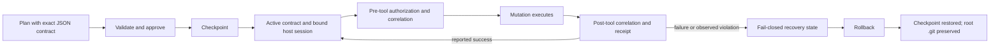

<p align="center">
  
</p>

<p align="center">
  <a href="https://github.com/iannellomarco/taskfence/actions/workflows/ci.yml"></a>
  <a href="LICENSE"></a>
  <a href="package.json"></a>
</p>

Plans are advisory: an agent can drift from an approved plan and still mutate the repository. **TaskFence turns one exact fenced JSON block in that plan into a frozen, hook-enforced contract.** Known read-only tools remain available, while commands and mutations require an active contract, the bound host-session authority, and an exact policy match.

TaskFence is application-level mediation for coding-agent tool calls. It checkpoints the project before activation, correlates each permitted mutation with the raw host input and reported outcome after the tool returns, records a tamper-evident receipt chain, and can restore the checkpoint when recovery is required.

<p align="center">
  
</p>

## Features

- One strict `taskfence-contract` JSON object, hashed together with the exact plan text and canonical project root
- Separate exact/subtree selectors for writes, creates, deletes, and protected paths
- Exact command `argv` and working-directory matching with one declared package-manager policy
- Explicit read-only catalogs; unknown or malformed hooked tools fail closed
- Pre-tool path/command authorization and post-tool raw-input/outcome correlation
- One pending mutation at a time, correlated by runtime, session, call ID, and raw-input hash
- Durable session-authority binding without silently granting unrelated or unverifiable child sessions
- Tamper-evident JSONL receipts whose hash-chain anchor is committed in durable state
- Rollback to the pre-approval checkpoint while preserving the project root's `.git` directory
- Idempotent user/project installers, uninstallers, and runtime diagnostics

## 60-second mental model

1. Put exactly one `taskfence-contract` fenced block in the plan. Every field is required and unknown fields are rejected.
2. Validate and approve that exact plan for an existing project root. Approval captures a checkpoint before the contract becomes active.
3. A supported host binds its stable session to the active contract. Read-only tools can run without a contract; mutations and commands cannot.
4. Before a mutation, TaskFence authorizes every path or the exact command, then durably records one pending call using the raw host input.
5. After the tool returns, TaskFence correlates the runtime, session, call ID, raw host input, and reported outcome, then appends a receipt. A failed outcome moves to `recovery_required`, an observed violation moves to `violated`, and mismatched correlation leaves the pending call fail-closed.



## Installation

TaskFence requires Node.js 20 or newer.

### From the npm package

After npm publication, install the package globally:

```sh
npm install --global taskfence
```

The package exposes both `taskfence` and the shorter `tf` executable.

### From source

```sh
git clone https://github.com/iannellomarco/taskfence.git
cd taskfence
npm ci
npm run build
node dist/cli.js status --root .
```

When running from a checkout, replace `taskfence` in the examples below with `node /absolute/path/to/taskfence/dist/cli.js`. Keep that checkout in place after installation: generated runtime configuration points to its built adapter.

## Quickstart

Install the hook for one runtime. Use `--scope project` to write project-local configuration; the default scope is `user`.

```sh
taskfence install claude --scope project --root .
```

Save this exact example as `PLAN.md` in the project root:

```taskfence-contract
{
  "version": 1,
  "write": ["src/index.ts"],
  "create": ["test/index.test.ts"],
  "delete": [],
  "protected": ["package-lock.json"],
  "commands": [
    {
      "argv": ["npm", "test", "--", "test/index.test.ts"],
      "cwd": "."
    }
  ],
  "packageManager": "npm"
}
```

Validate, approve, and inspect it:

```sh
taskfence contract validate PLAN.md --root .
taskfence approve PLAN.md --root .
taskfence status --root .
```

`approve` is interactive; add `--yes` only when the surrounding user-controlled workflow already provides the confirmation. Restart or reload the agent runtime after installing its hook or extension.

## Contract rules

### Path selectors

- Selectors are root-relative POSIX paths such as `src/index.ts`.
- A trailing `/**` is the only subtree form: `src/**` matches `src` and all descendants. Other glob syntax is rejected.
- `write` applies to an existing target, `create` to an absent target, and `delete` to an existing target. A rename requires the source to match `delete` and the destination to match `create`.
- `protected` wins over every allow selector. TaskFence always adds `.git/**`, `.taskfence/**`, `.claude/**`, `.codex/**`, `.opencode/**`, `.omp/**`, and `.pi/**`.
- Existing symlink traversal, physical/logical path disagreement, and multiply linked files are denied rather than guessed through.

### Commands and package managers

A command rule is an exact `argv` array plus an exact existing `cwd` inside the project root. There is no prefix or wildcard matching. Package-manager commands must run at the canonical root.

`packageManager` is one of `npm`, `pnpm`, `yarn`, `bun`, or `none`. If an approved command invokes a package manager, it must be the declared one; conflicting managers, `corepack` indirection, and manager/config overrides are rejected. `none` authorizes no package manager. TaskFence also rejects shell syntax it cannot reduce safely to one deterministic argument vector.

Approving an executable authorizes that exact top-level invocation. It does **not** sandbox or transitively constrain scripts, plugins, subprocesses, or other behavior launched by that command.

See the [Contract Reference](docs/contract-reference.md) for the complete schema and normalization rules.

## Runtime support and activation

| Runtime | Status | Activation UX |
| --- | --- | --- |
| Claude Code | Supported | Use normal plan mode. `ExitPlanMode` preflight validates the injected plan and returns `ask`; successful native user approval activates the exact returned plan and binds the root session. Direct CLI approval also works for an externally controlled flow. |
| OpenCode | Supported with explicit preapproval | Run `taskfence approve PLAN.md --root .`, then submit that exact plan through `plan_exit`. The plugin verifies root and hashes before claiming the host session. |
| OMP | Supported | In the active root session run `/taskfence approve PLAN.md`. The extension also provides `amend`, `status`, `rollback`, `complete`, and `revoke` subcommands. |
| Pi | Supported | In the active root session run `/taskfence approve PLAN.md`. The extension exposes the same `/taskfence` lifecycle commands as OMP. |
| Codex CLI 0.146.0 | Limited | Approve externally with the CLI. The first accepted, correlated file mutation binds the host session. `apply_patch` is mediated; command/shell tools are deliberately denied because later `write_stdin` calls are not visible to the current Codex hook surface. |

Install one or several adapters with runtime names `claude`, `codex`, `opencode`, `omp`, and `pi`:

```sh
taskfence install claude opencode --scope user --root .
taskfence install all --scope project --root .
taskfence uninstall opencode --scope project --root .
```

`taskfence doctor claude --scope project --root .` inspects the built adapter, installed configuration, and any recent loading heartbeat. Heartbeats are deliberately not bound to a project, process, or session, so `doctor` reports enforcement as unverified and returns nonzero even when its artifact and configuration checks pass. Treat it as diagnostic output, never as proof that hooks are enforcing.

An active contract binds to one runtime's root session. Child-session authority is granted only when that host supplies stable, verifiable ancestry; TaskFence does not claim universal inheritance across every agent or extension mechanism. See [Runtime Support](docs/runtime-support.md) for adapter-specific hook coverage and limitations.

## Operating the contract

```sh
# Inspect human-readable or machine-readable state
taskfence status --root .
taskfence status --root . --json

# Replace the active contract with another exact plan
taskfence amend PLAN-v2.md --root .

# Inspect rollback before changing the worktree, then restore the checkpoint
taskfence rollback --root . --dry-run
taskfence rollback --root .

# Verify and page through the receipt ledger
taskfence receipts verify --root .
taskfence receipts list --root . --limit 50
taskfence receipts list --root . --json

# End normally, or revoke with a durable reason
taskfence complete --root .
taskfence revoke --root . --reason "scope changed"
```

Commands that change lifecycle state prompt on a TTY. Their documented non-interactive form accepts `--yes`. `rollback --dry-run` reports the planned restore without changing the worktree; rollback preserves the root `.git` directory rather than replacing repository identity.

## State and receipts

By default TaskFence stores state outside the protected project root at:

```text
${TASKFENCE_STATE_DIR:-${XDG_STATE_HOME:-~/.local/state}/taskfence}/projects/<sha256-of-canonical-root>/
```

`TASKFENCE_STATE_DIR` and `XDG_STATE_HOME`, when set, must be absolute. Directories are current-user-owned mode `0700`; state, lock, checkpoint objects, transaction journals, and receipt files are validated as current-user regular files with mode `0600`. The project directory contains `state.json`, `receipts.jsonl`, checkpoint data, and crash-recovery journals.

Receipts form a SHA-256 chain and the current count, byte length, and last hash are anchored in `state.json`. This makes deletion, truncation, reordering, or modification detectable by `taskfence receipts verify`; it does not make same-user files immutable.

## Security boundary

> **TaskFence is not an OS or kernel sandbox.** It mediates tool calls at supported application hooks. A malicious process running as the same user, a disabled or modified hook/runtime/extension, another terminal or IDE, a daemon, native code, and side effects inside an explicitly approved command are outside its containment boundary. Do not use TaskFence as a substitute for OS isolation, containers, virtual machines, least-privilege credentials, or review of approved scripts.

The state store is hardened against accidental exposure and many path/link attacks, but the same user ultimately owns both runtime configuration and state. Receipt chains are tamper-evident, not tamper-proof. Read the [Threat Model](docs/threat-model.md) before using TaskFence for security-sensitive work and report vulnerabilities through [SECURITY.md](SECURITY.md).

## Development

```sh
npm ci
npm run check
npm test
npm run test:package
npm run check:artifact
npm run build
```

CI exercises the declared Node.js 20 floor and Node.js 22 on Linux. The implementation relies on POSIX ownership and permission semantics; this release does not claim a Windows enforcement boundary.

## Documentation

- [Architecture](docs/architecture.md)
- [Contract Reference](docs/contract-reference.md)
- [Runtime Support](docs/runtime-support.md)
- [Threat Model](docs/threat-model.md)
- [Contributing](CONTRIBUTING.md)
- [Code of Conduct](CODE_OF_CONDUCT.md)
- [Changelog](CHANGELOG.md)
- [Security policy](SECURITY.md)

## License

TaskFence is available under the [MIT License](LICENSE).
