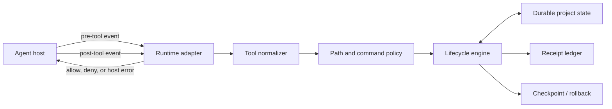
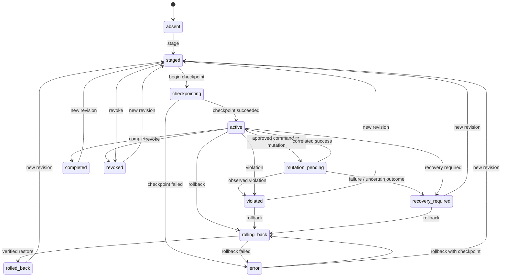

# Architecture

TaskFence is an application-level reference monitor for coding-agent tool calls. It turns one approved plan block into a frozen contract, binds that contract to a canonical project root and host session authority, checkpoints the worktree, and mediates later tool calls through runtime hooks. It is not an operating-system sandbox; see [Threat Model](./threat-model.md).

## Components



| Component | Responsibility |
| --- | --- |
| Runtime adapters | Validate bounded host payloads, map host names and arguments to the common tool model, fail closed on adapter errors, and correlate pre/post events. |
| Contract compiler | Extract exactly one `taskfence-contract` block, reject duplicate JSON keys and unknown schema fields, normalize selectors and command working directories, add protected defaults, and calculate hashes. |
| Tool normalizer | Classify only known read, command, write/create/delete/rename, and patch surfaces. Unknown or malformed tools are denied. |
| Policy core | Resolve targets under the canonical root, apply protected-path precedence, reject ambiguous links, parse the restricted command language, and require an exact command rule. |
| Lifecycle engine | Serialize approval, authority, mutation, completion, revocation, and rollback transitions under a root-scoped lock. |
| Checkpoint store | Capture the worktree except root `.git` into a content-addressed store before activation. |
| Receipt ledger | Append canonical, hash-chained JSONL records and commit receipt/state changes through a write-ahead log (WAL). |
| Rollback engine | Restore the checkpoint with a resumable, per-entry rollback journal while preserving root `.git`. |
| Installer and doctor | Install only TaskFence-owned hook/loader/extension entries and report local artifacts, configuration, and diagnostic host-loading heartbeats. |

## Durable state

The state schema is version 3. One state document contains:

- canonical `root` and `rootHash`;
- lifecycle `status`, monotonic `generation`, and monotonic contract `revision`;
- the compiled contract and checkpoint manifest;
- at most one `pendingMutation`, bound to runtime, session, call ID, raw input hash, contract hash, revision, and start time;
- session authority: one runtime, one root session, and a sorted parent-linked set of delegated sessions;
- an optional failure/recovery `reason`; and
- the receipt anchor: record count, last record hash, and ledger byte length.

State validation is strict: missing or unknown fields, incompatible schema versions, root/hash mismatches, malformed hashes or timestamps, invalid authority ancestry, and impossible lifecycle combinations are rejected.

### Storage paths

The default base is `${XDG_STATE_HOME}/taskfence` when `XDG_STATE_HOME` is an absolute path, otherwise `~/.local/state/taskfence`. `TASKFENCE_STATE_DIR` may override the project-state base with an absolute path. The state directory must be outside the protected project root, be owned by the current user, be a real directory rather than a symlink, and is normalized to mode `0700`.

For canonical root hash `H = SHA-256(canonicalRoot)`, project data lives under:

```text
<state-base>/projects/H/
  state.json
  state.lock
  state.lock.recover       # present only during stale-lock recovery
  transaction.json         # receipt/state WAL; present only while pending/recovering
  receipts.jsonl
  rollback-journal.json    # present only while rollback is pending/recovering
  checkpoints/
    objects/               # content-addressed checkpoint objects
    ...                    # rollback staging retained outside the project root
```

State, lock, WAL, journal, receipt, and temporary files use owner-only modes where created. State replacement is written to a fresh file, `fsync`ed, renamed over `state.json`, and followed by a directory `fsync`.

## Lifecycle



Every transition carries the expected generation and revision. A stale caller cannot overwrite a newer state. Each successful transition increments generation; stage/amend also advances revision by exactly one at the engine boundary. An amendment is permitted only while active, keeps the existing checkpoint, and cannot remove any currently protected selector.

## Approval and checkpoint transaction

1. The compiler canonicalizes the existing project root and compiles the exact approved plan text. `planHash` covers the complete plan text, not only the contract block.
2. Under the project lock, TaskFence stages the next revision and commits the lifecycle receipt and state together through the receipt WAL.
3. When the host provides a trusted approval identity (currently Claude `ExitPlanMode`, or the OMP/Pi user command), TaskFence binds that runtime/root session before checkpointing. External CLI approval can activate without an initial session; the first admitted host call then binds it.
4. TaskFence enters `checkpointing` durably.
5. Outside the state lock, it scans the worktree twice. The root `.git` entry is excluded. Regular files, directories, and symlinks are represented in a manifest; unsupported special files fail checkpointing. File objects are placed in the external content-addressed store.
6. Under the lock, TaskFence records either `checkpoint_failed -> error`, or installs the verified manifest and records `checkpoint_succeeded -> active`.

Activation is therefore not reported until the checkpoint manifest and its receipts are durable. A compiled or staged contract alone is not active authority.

## Pre-tool flow

1. The adapter validates the host payload and supplies runtime, raw host input, canonical/observed cwd, session ID, optional parent ID, and call ID.
2. The engine discovers the nearest durable TaskFence state boundary from the observed cwd and normalizes the tool call.
3. Authority is checked. If authority is unbound, only a valid root session can bind it. A new child can be delegated only when its host-verified parent already belongs to the same runtime authority tree.
4. Explicitly classified read-only calls are allowed even with no active contract. Unknown and malformed calls are denied.
5. Commands and mutations require `active` state, the frozen contract, authorized session/call IDs, exact policy authorization, and no pending mutation/recovery condition.
6. Before returning allow, TaskFence hashes the **raw host input** and durably transitions to `mutation_pending`. The pending record and decision receipt commit through the WAL.

Commands share the pending-mutation slot because an approved command may mutate indirectly. Only one command or mutation can be in flight for a project. Concurrent attempts are denied until post-tool reconciliation completes.

## Post-tool flow

The adapter correlates the post event with the pre event using runtime, session, call ID, and the raw-input hash. It then reports success, failure, or an observed violation to the engine:

- correlated success returns `mutation_pending -> active`;
- an explicit observed violation returns `mutation_pending -> violated`; and
- failure or uncertain execution returns `mutation_pending -> recovery_required`.

The transition and its result receipt are one durable transaction. An input mismatch does not clear the pending record, so later commands/mutations remain denied.

The current adapters correlate host inputs and host-reported success; they do **not** compare the entire checkpoint tree after every successful tool call. Full checkpoint comparison is used by rollback preview and rollback verification. A post hook is evidence/reconciliation after execution, not a mechanism that can undo an already performed side effect.

## Session authority and delegation

Authority is deliberately narrower than “same project”:

- it is bound to exactly one runtime;
- the root session has a null parent;
- every delegated session has exactly one already-authorized parent;
- stored ancestry must be acyclic and reach the root session; and
- the authority set is cleared on rollback success, completion, and revocation.

Claude supplies a root session plus `agent_id`; the adapter derives a stable child identifier and parent link. OpenCode synchronously fetches session metadata and verifies its canonical directory and optional `parentID`; unresolved ancestry is denied. The current OMP, Pi, and Codex adapters do not establish general child-session delegation. Tool catalogs also deny unknown child-spawn tools, so TaskFence makes no universal child-agent inheritance claim.

## Receipts and state WAL

Each receipt includes sequence, timestamp, event type, root and root hash, contract/checkpoint hashes, revision, optional runtime/session/call/tool/input data, decision or lifecycle data, a result hash, bounded metadata, the previous receipt hash, and its own `recordHash`.

`recordHash = SHA-256(canonicalJSON(receipt without recordHash))`. The next record stores that hash as `previousHash`. The state anchor stores the expected record count, head hash, and exact ledger byte length.

A transition transaction is committed as follows:

1. Verify that the current state and ledger tail match the caller's before-state and anchor.
2. Build one to sixteen canonical receipt records and the resulting state anchor.
3. Durably write and rename `transaction.json`. This WAL is the commit point.
4. Append and `fsync` the receipt bytes.
5. atomically install and sync the next state.
6. remove the WAL and sync its directory.

Every project-lock acquisition first recovers a durable WAL. Recovery accepts only state/ledger positions that match the WAL's exact before or after boundary and exact receipt prefix; ambiguous divergence is rejected. If a post-WAL failure cannot be reconciled immediately, the caller receives an explicit indeterminate-transaction error rather than a false rejection.

## Rollback journal and recovery

Rollback verifies the checkpoint manifest and stages both the desired tree and retained backups outside the project root. It records a mode-`0600` journal bound to the canonical root inode identity and manifest hash. The journal contains a cursor and per-top-level-entry phases (`pending`, `backed_up`, `installed`, `completed`). Each rename boundary checks live inode identity and updates the journal durably, allowing a later rollback invocation to resume.

Root `.git` is never included in the checkpoint and is explicitly skipped when rollback enumerates entries to remove. Rollback restores the checkpointed non-`.git` tree, restores the root mode, syncs root and parent directories, compares the result to the manifest, and only then removes the journal and staging trees. A failed comparison leaves recovery material intact.

## Core invariants

1. Read-only calls may run without a contract; commands and mutations may not.
2. A contract is bound to the exact canonical root, complete plan hash, compiled contract hash, and revision.
3. The checkpoint must exist before `active` state.
4. Protected selectors override every write/create/delete selector.
5. Unknown tools, malformed inputs, ambiguous paths, stale state transitions, missing authority, and policy uncertainty deny rather than broaden authority.
6. At most one command/mutation is pending per project, correlated by the raw host input.
7. Contract authority cannot cross runtimes or widen through unverified ancestry.
8. State transitions and receipts advance together through a recoverable WAL.
9. Rollback preserves root `.git` and is not complete until the restored tree matches the checkpoint.
10. These invariants hold inside TaskFence's application/tool-hook boundary, not against an adversarial same-user process or kernel-level race.
