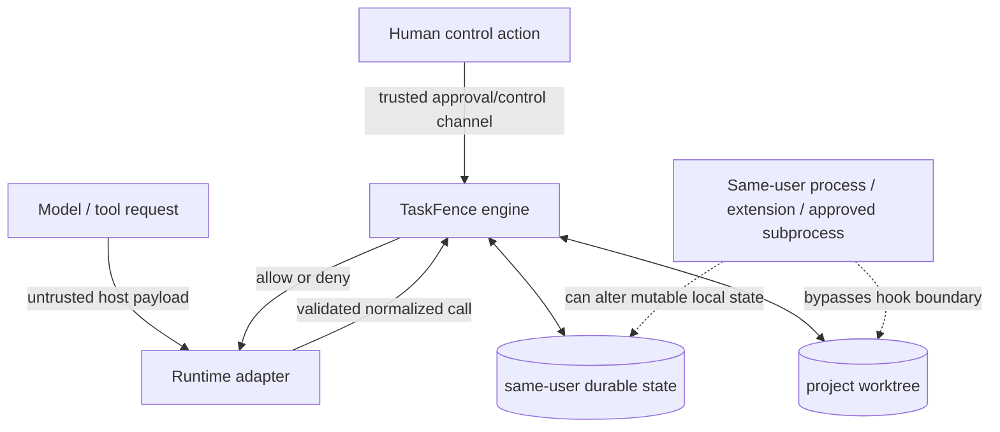

# Threat Model

## Security objective

TaskFence limits mutation authority exposed through supported coding-agent application tool hooks. For one canonical project root, it aims to ensure that a command or filesystem mutation observed at those hooks runs only when it matches a frozen active contract, an authorized host session, and the current durable lifecycle state. It records the decision and outcome correlation and can restore the checkpointed non-`.git` worktree.

This is a narrower objective than sandboxing a process. TaskFence does not claim to contain arbitrary code running as the user.

## Assets

| Asset | Required property |
| --- | --- |
| Project worktree | Only contract-authorized observed tool mutations; recoverable to the pre-activation checkpoint except root `.git`. |
| Contract | Exact approved plan, normalized document, canonical root, package manager, revision, and hashes cannot be silently widened through a tool call. |
| Session authority | One runtime/root session; only host-verified descendants may join. |
| Checkpoint/CAS | Captures a stable pre-activation non-`.git` tree and remains outside the project root. |
| Lifecycle state | Strict, monotonic generation/revision; no stale overwrite or impossible state combination. |
| Receipt ledger and anchor | Detect truncation, replacement, reordering, field changes, and broken chaining relative to the currently anchored state. |
| WAL and rollback journal | Permit deterministic recovery after an ordinary crash or power loss at documented transaction boundaries. |

## Actors and trust assumptions

### Trusted for the stated objective

- The human invoking the standalone TaskFence CLI or a host command context documented as user-initiated.
- The TaskFence distribution, installed adapter path, policy code, and Node runtime before compromise.
- The operating system, filesystem, cryptographic SHA-256 implementation, and kernel permission/rename/fsync semantics for ordinary crash recovery.
- Supported host hook delivery for the checked runtime version, but only to the extent documented in [Runtime Support](./runtime-support.md).
- The same-user state directory against accidental changes, ordinary concurrent TaskFence processes, and non-malicious failures.

### Untrusted inputs

- Model-authored plans, messages, tool names, command strings, paths, JSON payloads, call IDs, and mutation arguments.
- Unknown/custom/MCP tools unless explicitly classified read-only or as a known mutation surface.
- Project contents, including symlinks, hard links, case-colliding names, malformed Unicode, special files, package scripts, and Git configuration.
- Host/plugin ordering and mutable tool arguments after another plugin or extension has handled them.
- A post-tool success/failure signal as evidence of policy compliance beyond what the checked adapter can correlate.

### Outside the containment trust boundary

A malicious process already executing as the same OS user, a malicious or compromised host/extension, and subprocesses intentionally launched by an approved command are not contained. They can use filesystem/process APIs without a TaskFence tool event.

## Trust boundaries

1. **Human to control plane.** Direct CLI invocations and OMP/Pi user command handlers are authority-bearing. Model tool calls are not; TaskFence control verbs are denied inside command tools.
2. **Host to adapter.** Payloads are untrusted and bounded. A host event is not proof that an arbitrary field was authored by the human.
3. **Adapter to policy core.** Only normalized, explicitly classified calls enter policy evaluation. Unknown/malformed values deny.
4. **Policy to filesystem.** TaskFence performs canonical path checks and durable writes, but it is not a kernel reference monitor and does not hold every target through a directory file descriptor from check to host mutation.
5. **Local state.** Owner-only permissions and no-follow checks protect against accidents and other OS users under normal permissions. The directory is still mutable by the same user.
6. **Approved command to subprocess tree.** Exact argv/cwd approval authorizes the command's transitive behavior; child processes do not receive application tool hooks.

## Attacks defended within the boundary

### Contract substitution and widening

- Exactly one top-level exact `taskfence-contract` fence is accepted.
- Strict JSON rejects unknown fields and duplicate keys.
- `planHash` covers all approved plan text; `contractHash` covers canonical root, root hash, plan hash, and normalized contract.
- Selector/command duplicates and invalid normalization are rejected.
- Amendments require active state, advance the revision, preserve the checkpoint, and cannot remove a protected selector.
- Tool calls cannot invoke TaskFence approve/amend/revoke/rollback/install or related authority verbs through recognized direct/wrapped forms.

### Mutation without active approval

- Reads from the explicit read catalog may proceed without a contract.
- Commands and mutations require active state, a verified checkpoint, bound runtime/session authority, a non-empty call ID, and exact contract authorization.
- Unknown tools deny instead of being guessed read-only.
- Staged, checkpointing, pending, violated, recovery-required, rollback, terminal, and error states deny new commands/mutations.

### Path escape and protected-target mutation

- Project root and command cwd use native canonical `realpath`.
- Contract paths are relative POSIX, NFC-stable, and reject absolute, traversal, wildcard, encoded traversal, empty-segment, and backslash forms.
- Runtime target checks reject root escape, wrong case/case collision, symlink components, physical/logical mismatch, dangling links, and multiple hard links.
- Built-in `.git`, `.taskfence`, and host-configuration protected subtrees override all allowlists.
- Rename requires independently authorized delete and create sides and a nonexistent destination.

### Shell injection and wrapper bypass

- The restricted parser accepts one literal argv only: no pipeline, redirect, expansion, comment, command substitution, multiline command, environment assignment, nested shell, interactive/long-lived session, or general command indirection.
- Interpreter eval modes, common option-driven subprocess modes, Git alias/external-command modes, package-manager root/workspace/global overrides, manager conflicts, and TaskFence authority wrappers are denied before exact matching.
- Runtime argv and canonical cwd must equal the declared rule exactly.
- Background/PTY/interactive shell tool flags are rejected.
- Codex commands are completely disabled in the current adapter because later `write_stdin` calls lack fresh pre-tool mediation.

### Concurrent or changed tool input

- Project state uses an exclusive root-scoped lock, generation/revision compare-and-swap, and stale-lock recovery with inode-identity checks.
- Before allow, the raw host input is hashed and committed as the sole pending command/mutation.
- Post reconciliation must match runtime, authorized session, call ID, and raw input hash.
- A mismatch or absent post does not clear the pending record, so subsequent commands/mutations deny.
- OpenCode/OMP/Pi input mutation by another plugin may be detected at post even though post detection cannot undo effects.

### Crash, partial write, and rollback interruption

- State installation uses write/fsync/rename/directory-fsync.
- Receipt/state transactions establish a durable WAL before appending ledger bytes or installing the anchored state.
- Every lock acquisition reconciles a WAL only when state and ledger match exact before/after boundaries and receipt bytes match the committed prefix.
- Checkpoint scanning performs two passes and rejects a changing tree.
- Rollback uses external staging, a durable per-entry journal, inode/root identity checks, entry phases, directory syncs, and a final manifest comparison.
- Root `.git` is excluded from checkpoint/rollback replacement and explicitly preserved.

### Accidental state or ledger tampering

- State and receipt files have strict schemas and size bounds.
- State is bound to canonical root/root hash and validates lifecycle combinations, checkpoint/contract hashes, pending revision, and authority ancestry.
- Receipt records are canonical hash chains; state anchors record exact count, head hash, and byte length.
- Truncation, extension, reordering, content changes, and anchor mismatches are detected relative to the current state/WAL boundary.

## Fail-closed behavior

TaskFence denies new commands/mutations when it encounters:

- missing/inactive contract, missing checkpoint, pending mutation, violation, or required recovery;
- missing or conflicting runtime/session/call authority;
- unknown tools, malformed or oversized payloads, or an unrecognized tool argument shape;
- path canonicalization ambiguity, root mismatch, protected target, or operation mismatch;
- command parse, exact-rule, cwd, wrapper, or package-manager uncertainty;
- stale state transitions, corrupt state/anchor/WAL, or ambiguous transaction divergence; or
- adapter-internal errors on the supported pre-tool surfaces.

Adapter mechanisms are host-specific: Claude/Codex emit a blocking structured denial or exit 2 with a reason; OpenCode throws from the awaited before hook; OMP/Pi return `{block: true}`. Post-hook errors cannot block an effect that already happened, so they preserve or move the lifecycle into a state that denies the next command/mutation.

Fail-closed does not mean fail-safe availability. A corrupt or unmatched state, missing post event, stale lock that cannot be recovered, exhausted resource bound, or crashed journal can intentionally stop mutations until the user repairs, revokes, stages a new revision where legal, or rolls back.

## Explicit non-goals and residual risks

### No OS or kernel sandbox

TaskFence does not use a container, VM, seatbelt/seccomp profile, capability system, mandatory access control, or kernel filesystem mediation. It does not constrain direct syscalls, network access, process creation, CPU, memory, or devices. A compromised host process can bypass or disable its own application hooks.

### Malicious same-user process

A process running as the same user can mutate the worktree directly, race TaskFence, kill the adapter, edit ordinary host configuration, or rewrite TaskFence's user-owned state. Modes `0700`/`0600` separate other users under normal OS permissions; they do not defend against the owner, root, backup/restore tooling, or a compromised account.

### Arbitrary extensions and hook peers

OMP/Pi extensions run in process with arbitrary user permissions. OpenCode plugins share mutable args and sequential execution. Codex matching command hooks start concurrently. Claude can load other hooks/plugins. A malicious peer can perform direct side effects without invoking a model tool, mutate arguments after TaskFence preflight, suppress delivery, or disable configuration. Post correlation can detect some argument changes but cannot roll them back.

### Transitive behavior of approved commands

An exact approved command is a trust grant to that executable and its complete subprocess tree. Package scripts, compilers, tests, Git hooks, imported code, native addons, installers, and child processes may mutate paths not listed in the selector arrays, access the network, or persist processes. Their internal operations do not receive separate TaskFence tool hooks. Command policy prevents common wrapper escapes; it does not interpret or sandbox program semantics.

### Kernel TOCTOU and lack of `*at`/`renameat` confinement

Path checks and the host's later mutation are separate operations. TaskFence uses `realpath`, `lstat`, no-follow opens where it owns the open, metadata fingerprints, and rollback inode checks, but the host tool ultimately reopens paths. The implementation does not mediate host writes through retained directory file descriptors, `openat2` resolution constraints, or an atomic kernel policy, and Node path-based rollback renames are not equivalent to an externally anchored `renameat` transaction. A malicious concurrent same-user process can attempt path swaps between validation and use. This is outside the local application-hook guarantee.

### Mutable full state-directory replay outside the local-anchor model

The receipt head is anchored in `state.json`, and the state, ledger, WAL, checkpoint store, and journals all live in the same user-mutable state tree. The chain detects tampering relative to the currently loaded anchor, but there is no remote transparency log, trusted timestamp, hardware key, append-only filesystem, or independently stored head. A same-user attacker who can replace the **entire** state directory can replay a mutually consistent older state/ledger/checkpoint snapshot or delete it. Detecting such coherent full-tree replay requires an external trusted anchor and is explicitly out of scope.

### Read confidentiality and hosted/specialized paths

TaskFence permits explicitly known read-only tools without an active contract. It is not a data-loss-prevention system and does not protect secrets from reads, prompts, model context, network submission, or host features that bypass tool hooks. Codex hosted tools and host-specialized opt-out paths are documented gaps. A new tool is denied when it reaches TaskFence, but TaskFence cannot mediate an execution path for which the host emits no hook.

### Universal child-agent inheritance

There is no cross-runtime child authority guarantee. Claude child identity and OpenCode `parentID` have adapter-specific handling. The current OMP, Pi, and Codex adapters do not establish general parent ancestry, and unknown child-spawn tools are not allowed by the explicit catalogs. Host subprocesses and detached processes are not child sessions in the TaskFence authority model.

### Git history and external state

Checkpoint and rollback intentionally exclude root `.git`. Rollback restores the non-`.git` worktree, not branches, refs, index, reflogs, submodule repositories, external files, databases, cloud resources, network actions, or processes. An approved Git or package command can have durable effects outside the checkpoint.

### Availability and resource exhaustion

TaskFence bounds its own principal data structures but does not promise uninterrupted operation:

| Resource | Current bound/default |
| --- | --- |
| Approved plan | 8 MiB |
| Contract string | 65,536 UTF-8 bytes |
| Entries per selector/command collection | 10,000 |
| Arguments per command rule | 1,024 |
| Checkpoint entries/files | 100,000 |
| One checkpoint file | 1 GiB |
| Checkpoint total file bytes | 10 GiB |
| State file | 64 MiB |
| Receipt ledger | 64 GiB |
| Receipts in one state transaction | 16 |
| Rollback journal entries | 100,000 |
| Default lock acquisition timeout | 10 seconds |
| Default stale-lock age | 120 seconds |

A larger tree, unsupported special file, changing worktree, full disk, permission failure, fsync failure, corrupt journal, process crash, or host timeout can prevent activation or require recovery. Approved commands can consume unbounded CPU, memory, disk, network, or wall time outside these TaskFence bookkeeping limits. Denial-of-service by the same user, project content, host, or approved process is not prevented.

## Deployment interpretation

TaskFence is useful as a deterministic, auditable reduction of authority inside supported agent hosts. Treat it as one defense layer:

- keep the TaskFence distribution and host configuration under independent review;
- run a real known-denied smoke after installation and host upgrades;
- approve commands only when their transitive behavior is trusted;
- use OS sandboxing/containerization and least-privilege credentials for containment;
- store receipt heads externally when coherent local replay matters; and
- stop and recover/rollback on pending, violated, recovery-required, or ambiguous state rather than bypassing the fence.
